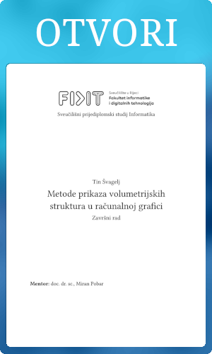

# Dokumentacija za završni rad

[](https://raw.githubusercontent.com/Caellian/UNIRI_voxels_doc/pdf/main.pdf)

## Izgradnja dokumenta

Za igraditi dokument, neovisno o OSu, pokrenuti:
```sh
typst compile --font-path="./fonts" main.typ
```

Typst treba biti instaliran i u `$PATH`u.

Fontovi i svi drugi neophodni popratni materijali su uključeni u strukturi projekta.
